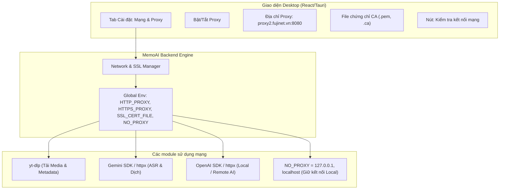

# Kế hoạch Triển khai Hỗ trợ Corporate Proxy & Custom CA/PEM Certificate cho MemoAI

## 1. Phân tích Hiện trạng & Vấn đề

Khi MemoAI chạy trên mạng doanh nghiệp (như mạng công ty với proxy `proxy2.fujinet.vn:8080` và chứng thực SSL qua file `.ca`/`.pem`):
- **Cơ chế SSL Interception (Man-in-the-Middle công ty)**: Firewall/Proxy của công ty giải mã lưu lượng HTTPS để quét bảo mật, sau đó ký lại bằng chứng chỉ Root CA nội bộ của công ty.
- **Hệ quả**:
  1. `yt-dlp` (khi tải video / lấy info YouTube) bị chặn và báo lỗi `SSL: CERTIFICATE_VERIFY_FAILED` hoặc lỗi timeout không kết nối được qua proxy.
  2. SDK Gemini (`google-genai` / `httpx`) và OpenAI-compatible (`httpx`) bị lỗi `CERTIFICATE_VERIFY_FAILED: self signed certificate in certificate chain`.
  3. Nếu cấu hình proxy toàn hệ thống không chuẩn, kết nối nội bộ giữa UI Tauri/React và Backend FastAPI (`127.0.0.1:8000`) có thể bị gửi nhầm lên proxy công ty, khiến app bị đơ hoặc lỗi kết nối local.

---

## 2. Mục tiêu Giải pháp

1. **Tương thích linh hoạt (Dual Environment)**:
   - **Mạng gia đình / Cá nhân**: Tự động nhận diện hoặc tắt Proxy, kết nối trực tiếp Internet tốc độ cao.
   - **Mạng doanh nghiệp**: Hỗ trợ đầy đủ Proxy URL (kèm user/pass nếu có) và nạp Custom CA Bundle (`.ca`, `.pem`, `.crt`).
2. **Cấu hình trực quan trên Desktop UI & file `.env`**:
   - Người dùng có thể thiết lập ngay trong mục **Cài đặt** của App (không cần am hiểu kỹ thuật để gõ lệnh dòng lệnh phức tạp).
   - Tự động lưu cấu hình vào CSDL SQLite của App (`memoai.db`) và đồng bộ qua biến môi trường.
3. **Nút "Kiểm tra kết nối Proxy & SSL"**:
   - Cho phép test ngay kết nối tới YouTube & Gemini API trước khi bắt đầu học/tải video, hiển thị thông báo lỗi rõ ràng nếu file CA sai định dạng.

---

## 3. Kiến trúc Giải pháp Kỹ thuật



---

## 4. Các bước Triển khai Chi tiết

### Bước 1: Mở rộng Model Cấu hình & Database (`backend/memoai/models.py` & `config.py`)
- Bổ sung các trường vào `AppSettings`:
  - `proxy_enabled: bool` (Mặc định: `False`)
  - `http_proxy: Optional[str]` (Ví dụ: `http://proxy2.fujinet.vn:8080`)
  - `https_proxy: Optional[str]` (Ví dụ: `http://proxy2.fujinet.vn:8080`)
  - `no_proxy: str` (Mặc định: `localhost,127.0.0.1`)
  - `ca_cert_path: Optional[str]` (Đường dẫn file `.ca`, `.pem` trên máy)
  - `insecure_skip_verify: bool` (Tùy chọn bỏ qua verify SSL nếu cần thử nghiệm khẩn cấp)
- Hỗ trợ fallback nạp từ file `.env` nếu có (`HTTP_PROXY`, `HTTPS_PROXY`, `SSL_CERT_FILE`, `REQUESTS_CA_BUNDLE`).

### Bước 2: Thiết lập Network/SSL Handler tập trung (`backend/memoai/network.py`)
- Khởi tạo hàm `apply_network_settings(settings: AppSettings)`:
  - Thiết lập biến môi trường chuẩn của Python và hệ điều hành:
    ```python
    os.environ["HTTP_PROXY"] = proxy_url
    os.environ["HTTPS_PROXY"] = proxy_url
    os.environ["NO_PROXY"] = "localhost,127.0.0.1"  # Rất quan trọng để tránh lỗi Desktop App <-> Backend
    os.environ["REQUESTS_CA_BUNDLE"] = ca_path
    os.environ["SSL_CERT_FILE"] = ca_path
    os.environ["CURL_CA_BUNDLE"] = ca_path
    ```
- Cung cấp hàm sinh `httpx.Client` hoặc cấu hình `ssl.SSLContext` dùng chung cho toàn bộ các provider AI.

### Bước 3: Cấu hình `yt-dlp` tương thích Proxy & CA (`backend/memoai/media/__init__.py`)
- Trong `download_media` và `extract_media_info`:
  - Truyền tham số `proxy` vào `ydl_opts` nếu proxy được kích hoạt.
  - Nếu có `ca_cert_path`: cấu hình `cafile: str(ca_path)` cho `yt-dlp`.
  - Nếu `insecure_skip_verify`: đặt `nocheckcertificate: True`.

### Bước 4: Cấu hình Gemini & OpenAI SDKs tương thích Custom CA
- **Gemini (`google-genai`)**:
  - `google-genai` sử dụng `httpx` dưới nền. Khi `SSL_CERT_FILE` hoặc cấu hình client truyền `verify=ca_cert_path`, SDK sẽ tin cậy chứng chỉ của công ty và thực hiện ASR / Dịch bình thường.
- **OpenAI-compatible**:
  - Cấu hình `http_client=httpx.Client(verify=ca_cert_path, proxy=proxy_url)` truyền trực tiếp vào `OpenAI(http_client=...)`.

### Bước 5: API Endpoint Test Kết nối (`backend/memoai/api/server.py`)
- Endpoint: `POST /api/settings/test-network`
  - Nhận cấu hình proxy + file CA.
  - Thực hiện kiểm tra 2 bước:
    1. Test kết nối tới YouTube (gọi `yt-dlp` lấy metadata nhỏ hoặc test HTTPS handshake).
    2. Test HTTPS handshake tới `generativelanguage.googleapis.com` (Gemini API).
  - Trả về kết quả trực quan (Ping time, SSL Handshake thành công / mã lỗi cụ thể nếu thất bại).

### Bước 6: Cập nhật Giao diện Cài đặt Desktop (`SettingsModal.tsx`)
- Thêm Tab **"Mạng & Proxy (Corporate)"**:
  - Toggle: **Bật Proxy mạng công ty**.
  - Input: **Địa chỉ Proxy** (Placeholder: `http://proxy2.fujinet.vn:8080`).
  - Input & File Selector: **File chứng chỉ CA (.pem, .ca, .crt)** kèm nút chọn file trên máy tính.
  - Checkbox cảnh báo: **Bỏ qua xác thực SSL (Insecure)** cho trường hợp khẩn cấp.
  - Nút **"Kiểm tra kết nối mạng"**: bấm vào sẽ test tức thì và báo kết quả bằng icon xanh/đỏ rõ ràng.

---

## 5. Kế hoạch Kiểm thử & Đảm bảo Không ảnh hưởng Máy hiện tại

| Môi trường | Kịch bản kiểm tra | Kỳ vọng |
| :--- | :--- | :--- |
| **Máy hiện tại (Không Proxy)** | Proxy Toggle = OFF | Kết nối trực tiếp Internet, tốc độ tối đa, không có bất kỳ thay đổi nào so với hiện tại. |
| **Máy Fujinet (Có Proxy & CA)** | Proxy Toggle = ON, nhập `proxy2.fujinet.vn:8080`, chọn file `fujinet.ca` | Bấm "Test kết nối" báo Thành công. Tải video YouTube và tạo phụ đề Gemini chạy mượt mà không còn lỗi TLS. |
| **Giao tiếp nội bộ Desktop App** | Proxy Toggle = ON | Các request giữa React UI và Backend `127.0.0.1` được bảo vệ bởi `NO_PROXY`, không bao giờ bị nghẽn hay lỗi timeout. |
